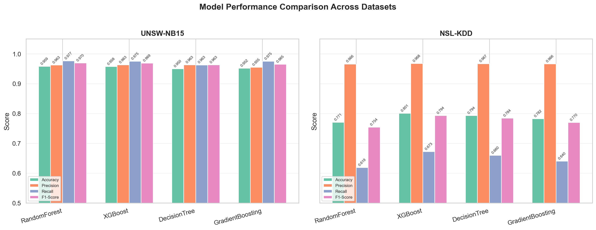
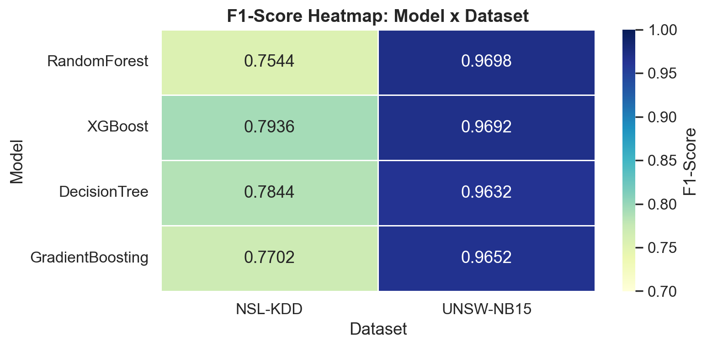
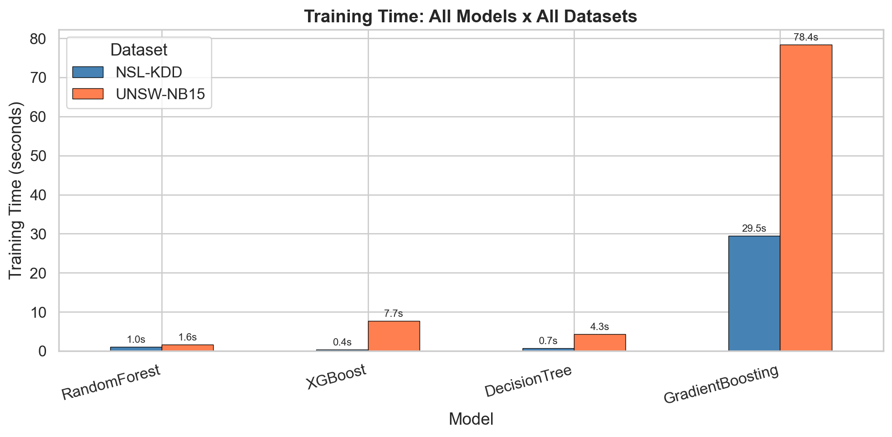
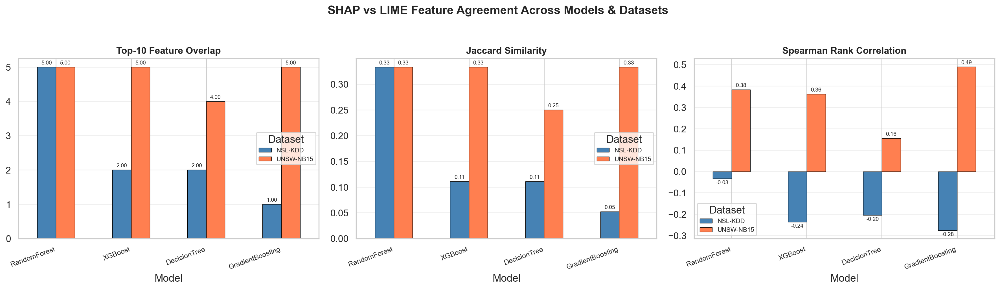
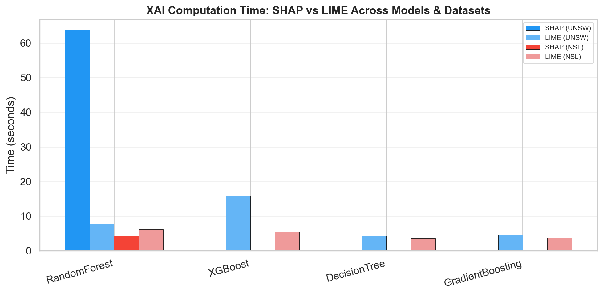
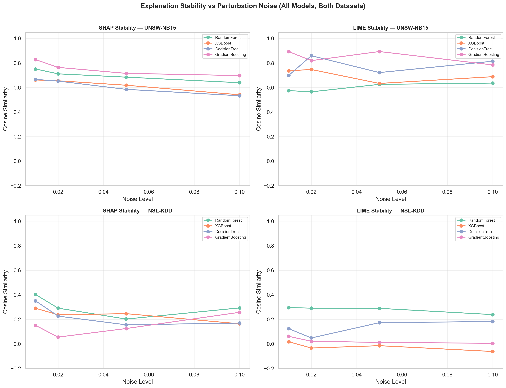
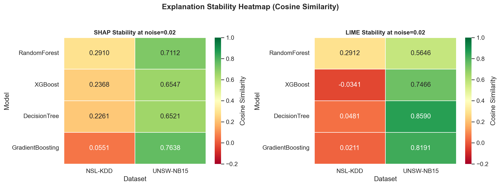
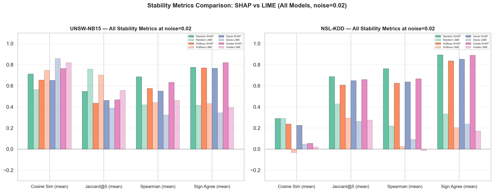

# Stability and Reliability of Explainable AI (XAI) in ML-Based Network Intrusion Detection Systems

## Overview
This project evaluates the **stability and reliability** of Explainable AI methods (SHAP, LIME) applied to machine-learning-based Network Intrusion Detection Systems (NIDS). It compares explanation stability across multiple ML models, datasets, noise levels, and stability metrics.

Additionally, a deep learning based intrusion detection model is implemented to explore the performance of neural networks on the NSL-KDD dataset.

## Datasets
| Dataset | Records | Features | Source |
|---------|---------|----------|--------|
| UNSW-NB15 | 175,341 | 42 | UNSW Sydney |
| NSL-KDD | 125,973 + 22,544 | 41 | UNB Canada |

## ML Models
- Random Forest
- XGBoost
- Decision Tree
- Gradient Boosting

## Deep Learning Model

In addition to traditional machine learning models, a deep learning based
Network Intrusion Detection model was implemented to evaluate the capability
of neural networks for intrusion detection tasks.

### Architecture
A Multi-Layer Perceptron (MLP) neural network was implemented using
TensorFlow/Keras with the following structure:

Input Layer → 128 Dense (ReLU) → Dropout (0.3) →  
64 Dense (ReLU) → Dropout (0.3) →  
Output Layer (Sigmoid)

### Dataset Used
- NSL-KDD

### Evaluation Metrics
- Accuracy
- Precision
- Recall
- F1 Score

### Outputs Generated

The deep learning pipeline generates the following outputs in the `results/` directory:

- `deep_learning_results.csv` — evaluation metrics
- `confusion_matrix_dl.png` — confusion matrix visualization
- `training_loss_dl.png` — training vs validation loss curve

## XAI Methods
- **SHAP** (SHapley Additive exPlanations) — TreeExplainer
- **LIME** (Local Interpretable Model-Agnostic Explanations)

## Stability Metrics
- Cosine Similarity
- Jaccard Similarity (Top-K feature overlap)
- Spearman Rank Correlation
- Feature Sign Agreement

## Results

### Model Performance Comparison


### F1-Score Heatmap


### Training Time Comparison


### SHAP vs LIME Feature Agreement


### XAI Runtime Comparison


### Explanation Stability vs Perturbation Noise


### Stability Heatmap (SHAP vs LIME at noise=0.02)


### Multi-Metric Stability Comparison


## Key Findings
1. **SHAP is significantly more stable than LIME** — cosine similarity ~0.7 vs ~0.3 under perturbation
2. **Stability degrades with noise** for both methods, as expected
3. **GradientBoosting** has the most stable SHAP explanations on UNSW-NB15 (cos=0.83)
4. **LIME shows near-zero or negative correlations** on NSL-KDD — a critical reliability concern
5. **Correct predictions** tend to have more stable explanations than incorrect ones

## Project Structure
```
├── datasets/               # UNSW-NB15 and NSL-KDD CSVs (gitignored)
├── models/                 # Trained model .pkl files (gitignored)
├── results/                # All output tables, plots, figures
├── preprocessing.py        # Data loading, encoding, scaling
├── download_datasets.py    # Download datasets
├── deep_learning_nids.py   # Deep learning intrusion detection model
├── Full_Analysis.ipynb     # Complete analysis notebook
├── requirements.txt
└── README.md
```

## How to Run

```bash
pip install -r requirements.txt
python download_datasets.py
```

Then open `Full_Analysis.ipynb` in Jupyter or VS Code and **Run All**.
