# Extended XAI Analysis — SVM, KNN & MLP on Network Intrusion Detection Datasets

> **Project:** Stability and Reliability of Explainable AI (XAI) in ML-Based Network Intrusion Detection Systems  
> **Notebook:** `Ishita_xai_analysis.ipynb`  
> **Datasets:** UNSW-NB15, NSL-KDD  
> **Models:** Support Vector Machine (SVM), K-Nearest Neighbours (KNN), Multilayer Perceptron (MLP)  
> **XAI Methods:** SHAP (KernelExplainer), LIME  
> **Stability Metrics:** Cosine Similarity · Jaccard@5 · Spearman Rank Correlation · Sign Agreement  

---

## Table of Contents

1. [Project Background](#1-project-background)
2. [What This Notebook Does](#2-what-this-notebook-does)
3. [Datasets](#3-datasets)
4. [Models](#4-models)
5. [XAI Methods](#5-xai-methods)
6. [Stability Metrics](#6-stability-metrics)
7. [Results and Analysis](#7-results-and-analysis)
   - [7.1 Model Performance](#71-model-performance)
   - [7.2 SHAP vs LIME Feature Agreement](#72-shap-vs-lime-feature-agreement)
   - [7.3 XAI Computation Time](#73-xai-computation-time)
   - [7.4 Stability Analysis](#74-stability-analysis)
8. [Key Findings](#8-key-findings)
9. [How to Run](#9-how-to-run)
10. [Output Files](#10-output-files)
11. [References](#11-references)

---

## 1. Project Background

Network Intrusion Detection Systems (NIDS) are a critical layer of cybersecurity infrastructure, responsible for identifying malicious network traffic in real time. As machine learning and deep learning models have become the backbone of modern NIDS, the question of *explainability* has grown increasingly important: when a model flags a connection as an attack, security analysts need to understand *why* — which features drove that decision, and how reliably those explanations hold up.

The group's core analysis evaluated two widely-used XAI methods — SHAP and LIME — on four tree-based classifiers (Random Forest, XGBoost, Decision Tree, Gradient Boosting) across two benchmark datasets (UNSW-NB15 and NSL-KDD). That work measured both feature importance agreement between the two methods and explanation stability under input perturbation.

This notebook extends that analysis to three architecturally distinct model types that were not covered in the group's work: a kernel-based model (SVM), an instance-based model (KNN), and a deep learning model (MLP). The research question is the same — *how reliable and stable are SHAP and LIME explanations?* — but the answer may differ substantially when the underlying model architecture changes.

---

## 2. What This Notebook Does

The notebook is structured in six sections that together form a complete, self-contained analysis:

| Section | What happens |
|---------|-------------|
| **0** | Auto-downloads NSL-KDD; checks for UNSW-NB15 files |
| **1** | Loads and preprocesses both datasets using the same pipeline as the group |
| **2** | Trains SVM, KNN, and MLP; evaluates classification performance |
| **3** | Runs SHAP (KernelExplainer) and LIME on all trained models |
| **4** | Computes SHAP vs LIME feature agreement metrics and produces comparison plots |
| **5** | Evaluates explanation stability under Gaussian input perturbation at four noise levels |
| **6** | Summarises all results in tables |

All intermediate results are saved to `results/` as both CSV files and publication-quality figures.

---

## 3. Datasets

| Dataset | Records | Features | Source |
|---------|---------|----------|--------|
| UNSW-NB15 | 175,341 (train) + test | 42 | University of New South Wales |
| NSL-KDD | 125,973 (train) + 22,544 (test) | 41 | University of New Brunswick |

**UNSW-NB15** contains modern network traffic captured in a real test environment, with nine attack categories including Fuzzers, Analysis, Backdoors, DoS, Exploits, Generic, Reconnaissance, Shellcode, and Worms. It is generally considered more representative of current threat landscapes than older benchmarks.

**NSL-KDD** is a refined version of the classic KDD Cup 1999 dataset with duplicate records removed. It is well-established in the NIDS literature and allows direct comparison with published results. Its test set (`KDDTest+`) contains attack types not seen in training, making it a harder generalisation benchmark.

Both datasets are treated as binary classification tasks: normal traffic (label=0) vs attack traffic (label=1).

**Preprocessing:** Categorical features are label-encoded, all features are standardised using `StandardScaler` (fit on training set only, applied to test set). UNSW-NB15 uses an 80/20 stratified split; NSL-KDD uses its pre-defined train/test files.

---

## 4. Models

Three models are introduced in this notebook, each representing a fundamentally different learning paradigm:

### Support Vector Machine (SVM)
- **Type:** Kernel-based discriminative classifier
- **Configuration:** RBF kernel, C=1.0, γ=scale, `probability=True`
- **Training:** Subsample of 20,000 training instances (full training set is computationally intractable for SVM with probability estimates)
- **Why it matters:** SVM finds the maximum-margin hyperplane in a high-dimensional kernel space. Its decision boundary is globally smooth, which has direct implications for how SHAP attributes importance — KernelExplainer must approximate Shapley values through repeated model calls rather than exact tree traversal.

### K-Nearest Neighbours (KNN)
- **Type:** Instance-based (lazy) learner
- **Configuration:** k=7, distance-weighted voting, Euclidean metric
- **Training:** Subsample of 30,000 training instances; fitted model stores these as reference points
- **Why it matters:** KNN makes predictions by majority vote among the k nearest training examples. It has no learned parameters and no explicit feature weights, making it the hardest model to explain — both SHAP and LIME must probe the model externally with no access to internal structure.

### MLP (Multilayer Perceptron)
- **Type:** Feedforward deep neural network
- **Architecture:** Input → Dense(256, ReLU) → BatchNorm → Dropout(0.3) → Dense(128, ReLU) → BatchNorm → Dropout(0.3) → Dense(64, ReLU) → Dropout(0.2) → Dense(1, Sigmoid)
- **Training:** Adam optimiser (lr=0.001), binary cross-entropy loss, early stopping on validation loss (patience=3), batch size=256
- **Dataset:** UNSW-NB15 only (NSL-KDD is covered by the group's deep learning component)
- **Why it matters:** The MLP is the only differentiable model in the analysis. Unlike tree models and SVM/KNN, its predictions depend on learned weight matrices — making it amenable to gradient-based XAI in principle, though this notebook uses the same SHAP/LIME framework as all other models for direct comparability.

---

## 5. XAI Methods

### SHAP — SHapley Additive exPlanations
SHAP assigns each feature a contribution value derived from cooperative game theory. For a prediction f(x), the SHAP value φᵢ for feature i satisfies:

```
f(x) = E[f(x)] + Σ φᵢ
```

meaning attributions sum exactly to the difference between the prediction and the expected model output. This *completeness* property makes SHAP theoretically well-grounded.

For tree models, `TreeExplainer` computes exact SHAP values in polynomial time by traversing the tree structure. For SVM, KNN, and MLP — which have no tree structure — `KernelExplainer` is used instead. KernelExplainer approximates Shapley values by fitting a weighted linear model on perturbed inputs sampled around the instance being explained. It is model-agnostic but significantly slower and approximate.

**Background sample:** 100 randomly selected training instances (used to estimate E[f(x)])  
**Explained sample:** 50 test instances per model

### LIME — Local Interpretable Model-Agnostic Explanations
LIME explains individual predictions by fitting a simple interpretable model (linear regression) in the neighbourhood of the instance being explained. It generates perturbed samples around the input, weights them by proximity, and fits a local linear approximation whose coefficients serve as feature attributions.

LIME is model-agnostic by design — it treats the classifier as a black box and requires only a predict function. The same `LimeTabularExplainer` setup used by the group is applied here, with `num_features=10` and 50 explained instances per model.

---

## 6. Stability Metrics

Explanation stability is evaluated by comparing attributions computed on an original test sample with attributions computed on a slightly perturbed version of the same sample. If a small, semantically irrelevant change to the input causes large changes in the explanation, the explanation is unreliable for operational use.

Perturbation is Gaussian noise added independently to each feature: **x_perturbed = x + N(0, σ²)**, tested at σ ∈ {0.01, 0.02, 0.05, 0.10}.

Four metrics measure different aspects of agreement between original and perturbed attributions:

| Metric | What it measures | Range | Ideal value |
|--------|-----------------|-------|-------------|
| **Cosine Similarity** | Direction agreement between attribution vectors | [-1, 1] | 1.0 |
| **Jaccard@5** | Overlap between the top-5 most important features | [0, 1] | 1.0 |
| **Spearman Rank** | Rank-order correlation across all features | [-1, 1] | 1.0 |
| **Sign Agreement** | Fraction of features where attribution sign is preserved | [0, 1] | 1.0 |

A value near 0 means the explanation is unstable at that noise level. A negative cosine or Spearman means the explanation has *reversed* — a critical failure mode.

---

## 7. Results and Analysis

### 7.1 Model Performance

All models were trained and evaluated on held-out test sets. Performance is reported using four standard classification metrics.

| Dataset | Model | Accuracy | Precision | Recall | F1-Score | Train Time |
|---------|-------|----------|-----------|--------|----------|------------|
| UNSW-NB15 | **SVM** | 0.9375 | 0.9187 | **0.9963** | 0.9559 | 26.82s |
| UNSW-NB15 | KNN | 0.9377 | 0.9431 | 0.9668 | 0.9548 | 0.02s |
| UNSW-NB15 | **MLP** | **0.9451** | **0.9490** | 0.9715 | **0.9601** | 39.94s |
| NSL-KDD | SVM | 0.7812 | **0.9760** | 0.6312 | 0.7666 | 11.17s |
| NSL-KDD | KNN | 0.7724 | 0.9701 | 0.6192 | 0.7559 | 0.02s |

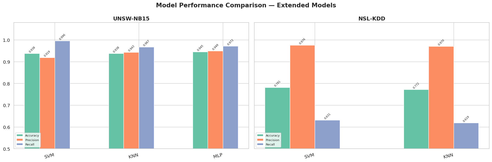

**Analysis:**

On **UNSW-NB15**, all three models achieve strong classification performance with F1-scores between 0.9548 and 0.9601. The differences between models are marginal — MLP leads by a small margin (F1=0.9601), but SVM and KNN are essentially equivalent in overall performance. What differs significantly is the precision-recall trade-off: SVM achieves recall of 0.9963 — meaning it correctly identifies nearly all attacks — while its precision (0.9187) is the lowest of the three. In a security context this is a reasonable trade-off: missing an attack (low recall) is more costly than generating a false alarm (low precision). KNN and MLP maintain a more balanced precision-recall profile.

On **NSL-KDD**, all models show a pronounced precision-recall imbalance — precision exceeds 0.97 for both SVM and KNN, while recall sits around 0.62–0.63. This pattern mirrors the group's findings for tree models on NSL-KDD and reflects the fundamental difficulty of the dataset: `KDDTest+` contains attack categories not present in training, and models tend to classify these unfamiliar attacks as normal (hence low recall). The high precision means that when a model does predict an attack, it is almost always correct — but it misses a significant fraction of actual attacks.

KNN's training time of 0.02s reflects the fact that KNN has no fitting step beyond storing training examples. SVM (26.82s on UNSW-NB15) and MLP (39.94s) require actual optimisation.

---

### 7.2 SHAP vs LIME Feature Agreement

After training, SHAP and LIME were applied to each model to identify which features drive predictions. Three metrics measure how much the two methods agree on feature importance.

| Dataset | Model | Top-10 Overlap | Jaccard | Spearman | SHAP Time | LIME Time |
|---------|-------|---------------|---------|----------|-----------|-----------|
| UNSW-NB15 | SVM | **7 / 10** | **0.5385** | 0.2381 | 127.9s | 69.5s |
| UNSW-NB15 | KNN | 6 / 10 | 0.4286 | **0.4364** | 98.8s | 56.2s |
| UNSW-NB15 | MLP | 6 / 10 | 0.4286 | 0.3578 | 40.0s | 27.4s |
| NSL-KDD | SVM | **0 / 10** | **0.0000** | **-0.5328** | 64.6s | 31.6s |
| NSL-KDD | KNN | 2 / 10 | 0.1111 | -0.3120 | 99.3s | 55.7s |

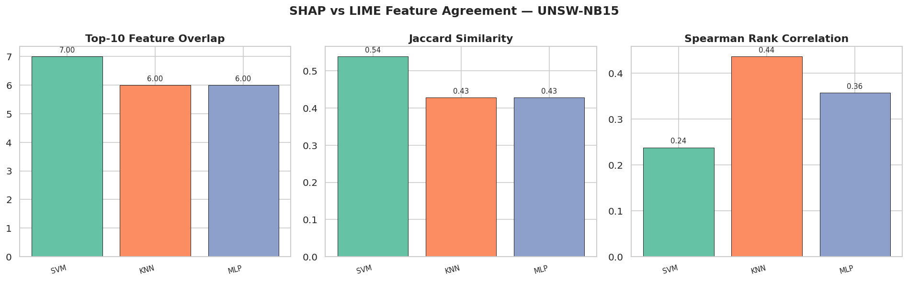

**Analysis — UNSW-NB15:**

On UNSW-NB15, SHAP and LIME show moderate agreement across all three models. SVM achieves the highest Top-10 overlap (7 out of 10 features identified by both methods) and Jaccard similarity (0.5385). KNN and MLP each share 6 features in their top-10 lists, with Jaccard of 0.4286. Spearman rank correlations are positive but modest (0.24–0.44), suggesting the two methods broadly agree on which features are important but differ on the precise ordering. This is consistent with what the group found for tree models on UNSW-NB15: the dataset's structured, well-separated feature distributions allow both methods to converge on a similar set of important features even if they disagree on fine-grained rankings.

**Analysis — NSL-KDD:**

The NSL-KDD results tell a starkly different story. SVM shows **zero overlap** between SHAP and LIME top-10 feature lists, a Jaccard of 0.0, and a Spearman of -0.5328. A negative Spearman means the two methods rank features in nearly opposite orders — SHAP's most important features are LIME's least important, and vice versa. KNN is similarly poor: only 2 shared features and Spearman=-0.3120. This represents a fundamental breakdown in explanation agreement, not just a quantitative disagreement.

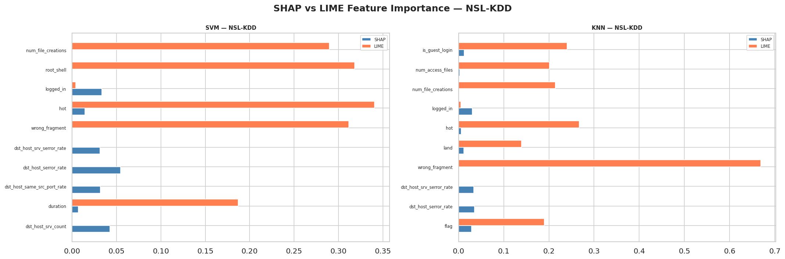

The side-by-side bar charts make this visible. For **SVM on NSL-KDD**, LIME assigns large weights to `hot`, `wrong_fragment`, `root_shell`, and `num_file_creations`, while SHAP considers these features nearly irrelevant. SHAP instead concentrates attribution on `dst_host_serror_rate`, `dst_host_srv_serror_rate`, and `dst_host_same_src_port_rate`. The two methods are essentially describing two completely different models. For **KNN on NSL-KDD**, `wrong_fragment` dominates LIME with a weight of ~0.68 while appearing negligible in SHAP — the largest discrepancy of any feature across all experiments.

This finding is significant: it confirms and extends the group's observation that LIME is unreliable on NSL-KDD. The group demonstrated this for tree models; this analysis shows the same phenomenon holds for kernel-based and instance-based models, suggesting the issue is rooted in the dataset's characteristics (hard test set, distribution shift between train and test) rather than any specific model architecture.

---

### 7.3 XAI Computation Time

A key practical consideration for deploying XAI in operational NIDS is computational cost. The group's tree models used `TreeExplainer`, which exploits the tree structure for exact, fast computation (under 5 seconds per model). All three models here require `KernelExplainer`, which is model-agnostic but approximate and significantly slower.

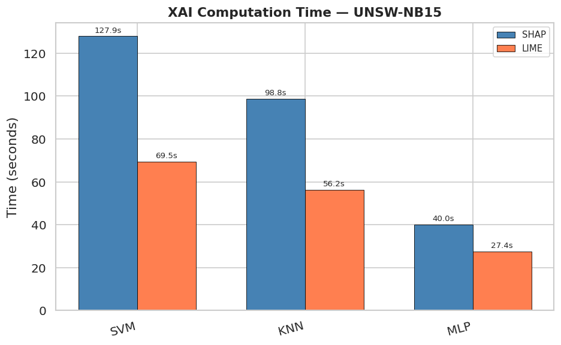

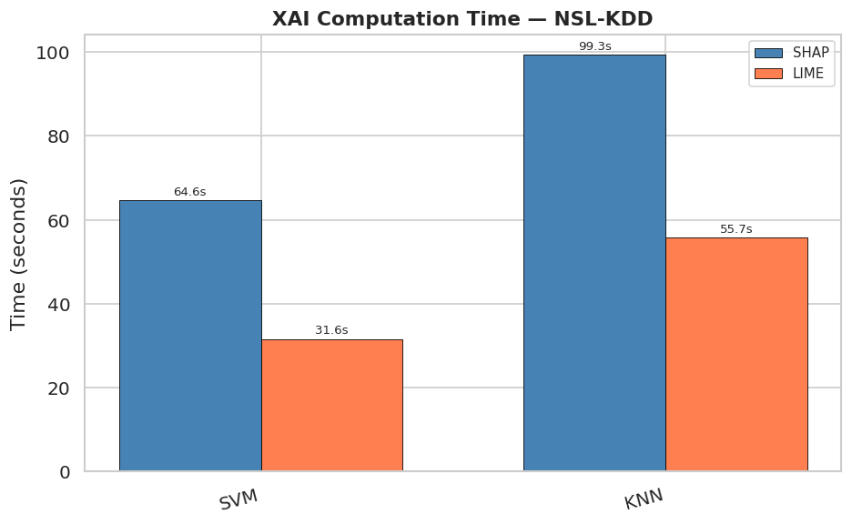

**Analysis:**

On UNSW-NB15, SHAP takes 127.9s for SVM, 98.8s for KNN, and 40.0s for MLP. LIME is consistently 45–55% faster: 69.5s, 56.2s, and 27.4s respectively. On NSL-KDD (SVM and KNN only, no MLP), SHAP takes 64.6s and 99.3s, with LIME again faster at 31.6s and 55.7s.

The MLP's lower SHAP runtime (40s vs 98–128s for SVM/KNN) reflects that batched neural network inference is faster than kernel evaluations (SVM) or nearest-neighbour search (KNN) when KernelExplainer repeatedly calls the model with perturbed background samples.

Comparing to the group's results: TreeExplainer on Random Forest (UNSW-NB15) takes under 2 seconds. KernelExplainer on SVM takes 128 seconds — a 60–70× overhead for the same dataset size. This gap has direct implications for real-time NIDS deployment: SHAP explanations for tree models can be generated near-instantaneously, while SHAP for SVM/KNN/MLP requires minutes per batch. Any NIDS that requires real-time explanations for individual alerts must either accept this latency or use approximate, faster variants of KernelExplainer.

---

### 7.4 Stability Analysis

This is the most analytically detailed section of the notebook. Stability measures whether small, irrelevant changes to the input produce small, consistent changes to the explanation. An unstable explanation cannot be trusted operationally — a security analyst cannot rely on feature attributions that change dramatically when a packet's byte count varies by a small amount.

#### Stability vs Noise Level — UNSW-NB15

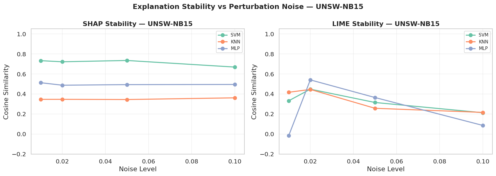

**SHAP stability (left panel):** On UNSW-NB15, SHAP explanations are remarkably consistent across all noise levels. SVM maintains cosine similarity around 0.72–0.73 from σ=0.01 all the way to σ=0.10 — barely changing even as noise increases tenfold. MLP is stable around 0.49–0.51, and KNN around 0.34–0.36. The near-flat curves indicate that SHAP attributions on UNSW-NB15 are robust to the tested perturbation range for all three architectures. This is a positive finding: SHAP on UNSW-NB15 can be trusted to give consistent explanations even when inputs have small measurement errors or natural variation.

**LIME stability (right panel):** LIME on UNSW-NB15 shows a different pattern — higher initial variability and clearer degradation with noise. SVM starts around 0.33–0.42 and drops to 0.21 at σ=0.10. MLP shows a notable anomaly: its LIME cosine similarity is *negative* at σ=0.01 (-0.016) but rises to 0.54 at σ=0.02 before declining. This non-monotonic behaviour suggests that very small perturbations sometimes push LIME's local sampling into regions where its linear approximation flips sign, while slightly larger perturbations average out this instability. At σ=0.10, MLP LIME drops to 0.085 — near-zero stability. This makes LIME unreliable for MLP at higher noise levels even on the more structured UNSW-NB15 dataset.

#### Stability vs Noise Level — NSL-KDD

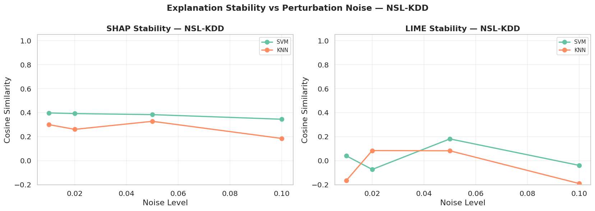

**SHAP stability (left panel):** On NSL-KDD, SHAP cosine stability is substantially lower than on UNSW-NB15 — SVM sits around 0.34–0.40 and KNN around 0.18–0.33. Both show mild decline with increasing noise, but the values are already low at σ=0.01, indicating that SHAP explanations on NSL-KDD are inherently less consistent. This likely reflects NSL-KDD's harder feature structure: with more distributional overlap between classes and unfamiliar attack patterns in the test set, the model's attribution landscape is less smooth and more sensitive to small input changes.

**LIME stability (right panel):** LIME on NSL-KDD is clearly unstable for both models. Cosine similarity oscillates between negative values and small positive values — SVM LIME drops to -0.073 at σ=0.02 and -0.040 at σ=0.10, while KNN LIME reaches -0.165 at σ=0.01 and -0.191 at σ=0.10. Negative cosine similarity means the attribution vector has reversed direction — the explanation for the perturbed input is pointing in the opposite direction to the explanation for the original input. This is a complete stability failure and confirms that LIME should not be used operationally for these models on the NSL-KDD benchmark.

#### Stability Heatmap at σ = 0.02

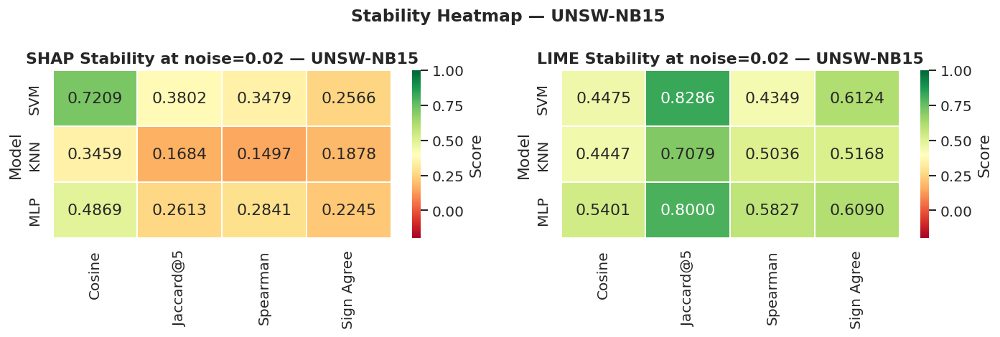

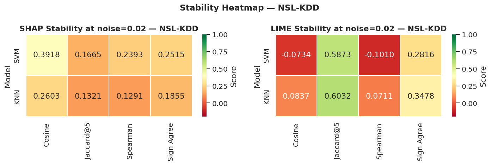

The heatmaps show all four stability metrics simultaneously at the reference noise level of σ=0.02, allowing patterns across metrics to be identified.

**UNSW-NB15 SHAP heatmap:** SVM stands out with the highest cosine similarity (0.7209) but relatively low Jaccard@5 (0.3802) and Sign Agreement (0.2566). This apparent contradiction is interpretable: while the overall *direction* of the attribution vector is well-preserved (high cosine), the *specific top-5 features* change under perturbation (lower Jaccard), and the *sign* of individual feature attributions is less consistent. SVM's smooth kernel boundary means the gradient of the decision surface is consistent in direction but the feature-level attribution landscape has more fine-grained sensitivity. KNN shows the lowest scores across all metrics (Cosine=0.3459, Jaccard=0.1684, Spearman=0.1497, Sign=0.1878), making it the least stable model for SHAP explanations on UNSW-NB15.

**UNSW-NB15 LIME heatmap:** The pattern reverses for LIME. Jaccard@5 scores are high across all three models (SVM=0.8286, KNN=0.7079, MLP=0.8000), meaning LIME consistently identifies the same top-5 features even under perturbation. However, cosine similarities are more moderate (0.45–0.54) and Spearman correlations are variable. This suggests that LIME's local linear approximation reliably identifies *which* features matter but is less consistent about the precise *magnitude* and *ordering* of attributions.

**NSL-KDD SHAP heatmap:** All values are lower than UNSW-NB15. SVM Cosine=0.3918, KNN Cosine=0.2603. Jaccard@5 is particularly low (0.1665 and 0.1321), meaning the top-5 features change substantially between original and perturbed inputs. This confirms that SHAP explanations are less reliable on NSL-KDD regardless of architecture.

**NSL-KDD LIME heatmap:** SVM LIME shows negative cosine (-0.0734) and negative Spearman (-0.1010), indicating explanation reversal. Jaccard@5 remains moderately high (0.5873) — LIME still identifies a consistent top-feature set, but the attribution directions and magnitudes are unreliable. KNN LIME is slightly better (Cosine=0.0837) but still near zero. The combination of high Jaccard but near-zero or negative cosine and Spearman means LIME can identify the *names* of important features but cannot reliably quantify their contribution direction — a critical limitation for any explanation that needs to be acted upon.

#### All Stability Metrics at σ = 0.02

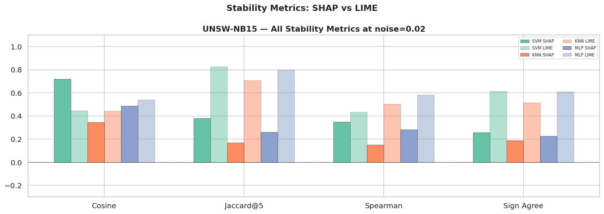

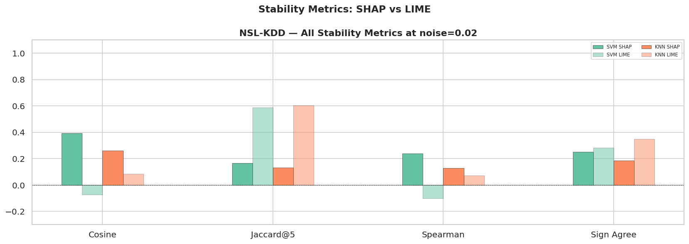

These bar charts allow direct SHAP vs LIME comparison per model across all four metrics simultaneously.

**UNSW-NB15:** LIME consistently outperforms SHAP on **Jaccard@5** for all three models — LIME Jaccard is 0.71–0.83 vs SHAP Jaccard of 0.17–0.38. SHAP, however, outperforms or matches LIME on **cosine similarity** for SVM (SHAP=0.72 vs LIME=0.45). For MLP, LIME has slightly higher cosine (0.54 vs 0.49). Spearman correlations are moderate for both methods, with LIME showing an edge for KNN and MLP. The Sign Agreement metric is consistently higher for LIME, suggesting that LIME's local linear model preserves feature attribution sign more reliably than SHAP's Shapley-based attribution under perturbation.

**NSL-KDD:** SHAP outperforms LIME on almost every metric for both models. SVM SHAP cosine (0.39) is far better than SVM LIME (-0.07). KNN SHAP cosine (0.26) beats KNN LIME (0.08). Jaccard@5 is the one exception where LIME scores higher — but as discussed above, high Jaccard with near-zero cosine and Spearman means LIME identifies the right feature *names* while getting their *contributions* wrong. This is arguably more dangerous than low Jaccard with positive cosine, because it creates false confidence in the explanation.

---

## 8. Key Findings

**Finding 1: UNSW-NB15 explanations are substantially more stable and consistent than NSL-KDD explanations across all models and both XAI methods.**

SHAP cosine stability on UNSW-NB15 ranges from 0.35 (KNN) to 0.72 (SVM); on NSL-KDD the same models produce 0.26–0.39. LIME agreement metrics are similarly lower on NSL-KDD. This suggests the reliability of XAI methods depends significantly on dataset characteristics — UNSW-NB15's structured, balanced features produce more stable attribution landscapes than NSL-KDD's harder, shifted test distribution.

**Finding 2: SHAP and LIME completely disagree on NSL-KDD for non-tree models.**

SVM on NSL-KDD: 0 features overlap in the top-10, Jaccard=0.0, Spearman=-0.53. KNN: 2 features overlap, Spearman=-0.31. When two explanation methods produce rankings that are negatively correlated, at least one of them must be substantially wrong. This extends the group's finding that LIME is unreliable on NSL-KDD to SVM and KNN architectures, suggesting the problem is rooted in the dataset rather than the model type.

**Finding 3: SHAP and LIME measure different aspects of stability — neither dominates on all metrics.**

On UNSW-NB15, LIME consistently achieves higher Jaccard@5 (top-feature stability) while SHAP achieves higher cosine similarity (directional stability) for SVM. These metrics capture complementary properties: which features appear important vs how attribution magnitudes and signs change. A practitioner who needs to know *which* features to investigate should prefer LIME on UNSW-NB15; a practitioner who needs consistent attribution *magnitudes* should prefer SHAP.

**Finding 4: KernelExplainer SHAP is 30–130× slower than TreeExplainer SHAP.**

The group's TreeExplainer on Random Forest runs in under 2 seconds. KernelExplainer on SVM takes 128 seconds on the same dataset. For operational NIDS that require real-time explanations, this latency gap makes model-agnostic SHAP impractical without significant engineering investment (batching, caching, approximate methods).

**Finding 5: KNN produces the least stable SHAP explanations on UNSW-NB15.**

KNN SHAP cosine stability (0.35) and Jaccard@5 (0.17) are the lowest of any model on UNSW-NB15. This is consistent with KNN's lack of a smooth decision boundary — small perturbations can change which neighbours are retrieved, leading to different prediction mechanisms and therefore different attributions. For NIDS deployments that require stable explanations, KNN is the least suitable architecture of the three evaluated here.

---

## 9. How to Run

### Prerequisites

```bash
pip install shap lime scikit-learn tensorflow pandas numpy matplotlib seaborn scipy joblib
```

### Dataset Setup

**NSL-KDD** is downloaded automatically when you run the first cell. No action needed.

**UNSW-NB15** must be downloaded manually:

1. Go to: https://research.unsw.edu.au/projects/unsw-nb15-dataset
2. Download the training and testing CSV files
3. Place them in a `datasets/` folder in the same directory as the notebook:

```
project_folder/
├── ishita_xai_analysis.ipynb
├── datasets/
│   ├── UNSW_NB15_training-set.csv
│   └── UNSW_NB15_testing-set.csv
```

The notebook will automatically create `results/` and `models/` directories on first run.

### Running the Notebook

```bash
jupyter notebook ishita_xai_analysis.ipynb
```

Then select **Kernel → Restart & Run All**.

On first run, model training takes approximately:
- SVM: 30–60 seconds (subsample of 20k)
- KNN: under 1 second (no fitting)
- MLP: 2–5 minutes (with early stopping)

All trained models are saved to `models/` as `.pkl` and `.keras` files. On subsequent runs, the training cells load from cache instantly and skip retraining entirely.

The SHAP and LIME computation cells are the most time-consuming:
- SHAP (KernelExplainer) on SVM: ~2 minutes
- SHAP (KernelExplainer) on KNN: ~1.5 minutes  
- SHAP (KernelExplainer) on MLP: ~40 seconds
- LIME on all models: roughly half the SHAP time

The stability analysis section runs SHAP and LIME at four noise levels for 50 samples per model — expect 20–40 minutes total for this section.

### If the Kernel Crashes or Restarts

All models are cached. Simply rerun cells from the top — the data loading and import cells must be rerun (they define variables in memory), but all training cells will load from cache in seconds. Jump to whichever analysis section you need after rerunning Sections 0–2.

---

## 10. Output Files

All outputs are saved to `results/` with the prefix `extended_` to distinguish them from the group's outputs.

### CSV Files

| File | Contents |
|------|----------|
| `extended_model_performance.csv` | Accuracy, Precision, Recall, F1-Score, and training time for all models and datasets |
| `extended_xai_agreement.csv` | Top-10 overlap, Jaccard, Spearman, and XAI runtimes per model and dataset |
| `extended_stability_results.csv` | Full stability results: all four metrics for every model, dataset, XAI method, and noise level |

### Figures

| File | Contents |
|------|----------|
| `extended_mlp_training_curves.png` | MLP loss and accuracy curves per epoch |
| `extended_performance_bars.png` | Side-by-side performance bar chart — all models, both datasets |
| `extended_confusion_matrices.png` | Confusion matrices for all model-dataset combinations |
| `extended_shap_summary_UNSW_NB15.png` | SHAP beeswarm summary plots — UNSW-NB15 |
| `extended_shap_summary_NSL_KDD.png` | SHAP beeswarm summary plots — NSL-KDD |
| `extended_agreement_UNSW_NB15.png` | SHAP vs LIME agreement metrics — UNSW-NB15 |
| `extended_shap_lime_bars_NSL_KDD.png` | Side-by-side SHAP vs LIME feature importance — NSL-KDD |
| `extended_xai_runtime_UNSW_NB15.png` | SHAP and LIME computation time — UNSW-NB15 |
| `extended_xai_runtime_NSL_KDD.png` | SHAP and LIME computation time — NSL-KDD |
| `extended_stability_noise_UNSW_NB15.png` | Cosine stability vs noise level — UNSW-NB15 |
| `extended_stability_noise_NSL_KDD.png` | Cosine stability vs noise level — NSL-KDD |
| `extended_stability_heatmap_UNSW_NB15.png` | All four stability metrics at σ=0.02 — UNSW-NB15 |
| `extended_stability_heatmap_NSL_KDD.png` | All four stability metrics at σ=0.02 — NSL-KDD |
| `extended_stability_metrics_UNSW_NB15.png` | SHAP vs LIME multi-metric bar chart — UNSW-NB15 |
| `extended_stability_metrics_NSL_KDD.png` | SHAP vs LIME multi-metric bar chart — NSL-KDD |

---
